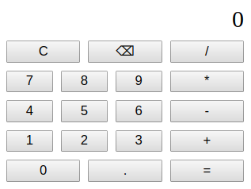

# ElTag Getting Started Tutorial

ElTag is an HTML tag component framework that generates responsive HTML from state, action, and view JavaScript components.

In this tutorial, you will create a simple calculator app using ElTag.



To get started, create a file named `calculator.js` and download this project's HTML and CSS files.
 * [index.html](index.html)
 * [calculator.css](calculator.css)

## Install the Library

ElTag is available through the jsDelivr CDN or as a [direct download](https://github.com/TSedlar/eltag/blob/master/eltag.js). Use the @latest tag to always request the newest code release.

```html
<script src='https://cdn.jsdelivr.net/gh/TSedlar/eltag@latest/eltag.min.js'>
```

The `eltag.js` script exposes the `ElTag` object containing the core framework and HTML tag functions. Unpack the variables needed for this tutorial.

```javascript
const { renderElement, app, range, each, div, button, span } = ElTag;
```

## Create the Application Skeleton

An ElTag app has actions, state, and a view.

Create the state object. The `display` variable will be used to display the current expression or solution.

```javascript
const state = {
    display: '0'
};
```

Create the actions object. This object will be populated with action functions that are available to the app's components.

```javascript
const actions = {

};
```

Create the view array. This array will contain the document tree to be generated when rendering the application.

```javascript
const view = [

];
```

You can now initialize an empty but functional ElTag application.

```javascript
const calculator = app({ state: state, actions: actions }, view);
renderElement(document.body, calculator);
```

The `app` function takes a properties object containing the app's state, actions, and any other information as needed. The `renderElement` function renders an ElTag app into the given element, here `document.body`.

## Create the View

ElTag offers each HTML tag as a function that takes a dictionary of attributes and optionally either an inner text string or an array of subcomponents.

Create the main div that will hold the calculator's display and button components. The linked stylesheet knows this div as `#calculator` and organizes its components according to a grid layout.

```javascript
const view = [
    div({ id: 'calculator' }, [

    ])
];
```

The calculator's single state variable is its display, which will be used to build expressions and calculate solutions. Create a span within the main div and give it an id, `"display"`, and a `render` attribute pointing to a function that returns the display state variable.

```javascript
const view = [
    div({ id: 'calculator' }, [
        span({
            id: 'display',
            render: () => this.state.display
        })
    ])
];
```

The `render` attribute is a special ElTag attribute that is called when rendering an element. The result of calling `render` is placed within the element's tags, allowing you to create dynamic elements that reflect the application state.

## Define the Application's Actions

Next, define the calculator's actions. These actions will be available to the view components' event handlers like `onclick`.

In most applications, the result of an action should be reflected in the view to show users that something happened when they give input to the application. You can initiate a re-render of the view using the `this.setState` function, which takes a new state object that is combined with the existing app or component state. The `this` keyword here refers to the ElTag application.

Add an `evaluate` action that replaces the display's expression with the evaluation of that expression.

```javascript
const actions = {
    evaluate: () => this.setState({ display: eval(this.state.display) })
};
```

Notice that you can access the current state with `this.state`. You can also use `this` to access the actions object and any other properties you passed to the app.

Add actions that clear the display, add a symbol to the display, add a number to the display, and delete the last character in the display.

```javascript
const actions = {
    evaluate: () => this.setState({ display: eval(this.state.display) }),
    clearDisplay: () => this.setState({ display: '0' }),
    addSymbol: symbol => this.setState({ display: this.state.display + symbol }),
    addNumber: number => {
        if (this.state.display === '0') {
            this.setState({ display: number });
        } else {
            this.actions.addSymbol(number);
        }
    },
    backspace: () => {
        let length = this.state.display.length;
        if (length > 1) {
            this.setState({ display: this.state.display.substring(0, length - 1) });
        } else {
            this.actions.clearDisplay();
        }
    }
};
```

## Complete the View

The application now knows what actions are available to it, so you can create the remaining view components that perform actions when clicked.

Create and add an equals button that evaluates the calculator's expression. Remember that the first argument to a tag function is the element's attributes, and the second argument is the element contents or inner text, `"="`.

```javascript
const view = [
    div({ id: 'calculator' }, [
        span({
            id: 'display',
            render: () => this.state.display
        }),
        button({
            id: 'equals',
            onclick: () => this.parent.actions.evaluate()
        }, '=')
    ])
];
```

You can use `this.parent` to access the app's actions and states from within an element. In this context, `this` refers to the current element and can be used to access this element's HTML attributes or state, if defined. This state is independent of the parent app state.

Add a button that clears the display and a button that clears the last character of the display.

```javascript
const view = [
    div({ id: 'calculator' }, [
        span({
            id: 'display',
            render: () => this.state.display
        }),
        button({
            id: 'equals',
            onclick: () => this.parent.actions.evaluate()
        }, '='),
        button({
            id: 'clear',
            onclick: () => this.parent.actions.clearDisplay()
        }, 'C'),
        button({
            id: 'backspace',
            onclick: () => this.parent.actions.backspace()
        }, '\u232b')
    ])
];
```

Add the number buttons to the calculator. Rather than write out each number button, you can use ElTag's `range` function, which takes an inclusive start, exclusive end, and callback function for what to do with each index. Create the buttons using the callback function, and use the spread operator `...` to expand the result of `range` into the main div's component array.

```javascript
const view = [
    div({ id: 'calculator' }, [
        span({
            id: 'display',
            render: () => this.state.display
        }),
        button({
            id: 'equals',
            onclick: () => this.parent.actions.evaluate()
        }, '='),
        button({
            id: 'clear',
            onclick: () => this.parent.actions.clearDisplay()
        }, 'C'),
        button({
            id: 'backspace',
            onclick: () => this.parent.actions.backspace()
        }, '\u232b'),
        ...range(0, 10, index => button({
            state: { number: index.toString() },
            id: 'number' + index,
            onclick: () => this.parent.actions.addNumber(this.state.number)
        }, index))
    ])
];
```

Notice that the `index` cannot be directly used in the buttons' `onclick` attributes. You must instead place the `index` or any other parameter of this scope into the component's local state object and access it via `this.state`. This step is a consequence of the app using a different calling context when later invoking the `onclick` function.

The only buttons remaining to add are the decimal point and the operators. These buttons will each call the `addSymbol` action, so you can create them using another convenient ElTag function, `each`. This function works like `Array.map` and takes an array and a callback function to perform for each element in the array.

Create the symbol button array containing each button's symbol and CSS id.

```javascript
const operators = [
    { symbol: '+', id: 'add' },
    { symbol: '-', id: 'subtract' },
    { symbol: '*', id: 'multiply' },
    { symbol: '/', id: 'divide' },
    { symbol: '.', id: 'dot' }
];
```

Use `each` and the spread operator `...` to create and add the symbol buttons to the view.

```javascript
const view = [
    div({ id: 'calculator' }, [
        span({
            id: 'display',
            render: () => this.state.display
        }),
        button({
            id: 'equals',
            onclick: () => this.parent.actions.evaluate()
        }, '='),
        button({
            id: 'clear',
            onclick: () => this.parent.actions.clearDisplay()
        }, 'C'),
        button({
            id: 'backspace',
            onclick: () => this.parent.actions.backspace()
        }, '\u232b'),
        ...range(0, 10, index => button({
            state: { number: index.toString() },
            id: 'number' + index,
            onclick: () => this.parent.actions.addNumber(this.state.number)
        }, index)),
        ...each(operators, item => button({
            state: { symbol: item.symbol },
            id: item.id,
            onclick: () => this.parent.actions.addSymbol(this.state.symbol)
        }, item.symbol))
    ])
];
```

The calculator is complete! Test the calculator if you have not yet done so and check that everything works as expected.

You can view the working calculator online [here](https://codepen.io/finnthompson/pen/wZmKYb).

View the ElTag project repository and other examples [here](https://github.com/TSedlar/eltag). Other functionalities not mentioned in this guide:
 * The `oninit` element attribute, called on element initialization.
 * The `onrender` element attribute, called on element render.
 * The `every` attribute, used to call a function at regular intervals.